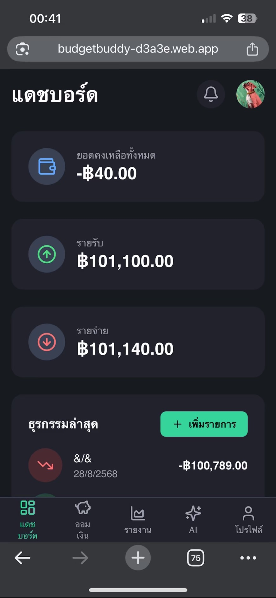
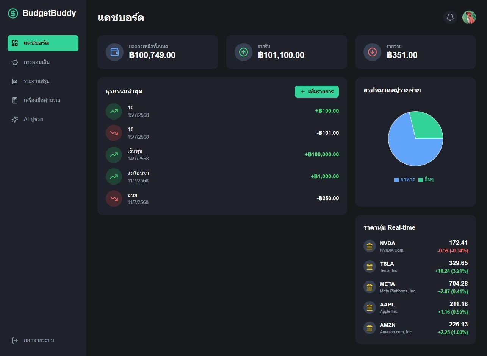

# 💸 BudgetBuddy

**BudgetBuddy** คือเว็บแอปจัดการการเงินส่วนบุคคล ที่ออกแบบมาให้ใช้งานง่ายและเป็นมิตรสำหรับทุกคน  
ผู้ใช้สามารถบันทึกรายรับ-รายจ่าย วางแผนงบประมาณ ติดตามเป้าหมายการออม และดูรายงานการเงินผ่านแดชบอร์ดแบบโต้ตอบ

---

## 🚀 Features

- ✅ **Income & Expense Tracking** — บันทึกรายรับ-รายจ่ายได้อย่างละเอียด
- 📊 **Spending Analytics** — แสดงกราฟ/ชาร์ต วิเคราะห์พฤติกรรมการใช้จ่าย
- 🎯 **Savings Goal Tracker** — ตั้งเป้าหมายการออม พร้อมติดตามความคืบหน้า
- 📅 **Budget Planning** — วางแผนงบประมาณรายเดือน
- 🏆 **Gamification** — ระบบ Badge/Level เพิ่มแรงจูงใจในการออม
- 🤖 **AI Financial Advisor** — ใช้ AI วิเคราะห์ข้อมูลและแนะนำวิธีบริหารเงิน
- 📱 **Responsive Design** — รองรับทั้งคอมพิวเตอร์และมือถือ
- ☁️ **Cloud-based** — ข้อมูลเชื่อมกับ Google Sheets (เก็บประวัติการใช้งาน)

---

## 🛠️ Tech Stack

- **Frontend:** HTML, CSS, JavaScript (Responsive UI, Modern Design)
- **Backend:** Node.js
- **Database:** Google Sheets (API Integration)
- **AI:** Google Gemini 1.5 (วิเคราะห์พฤติกรรมการเงิน)
- **Deployment:** Firebase Hosting
- **Design Theme:** Minimal, Gradient (เขียว–ฟ้า)

---

## 📸 Screenshots

<p align="center">
  <div style="display:inline-block; margin: 20px;">
    <h4 align="center">📱 Mobile View</h4>
    
  </div>

  <div style="display:inline-block; margin: 20px;">
    <h4 align="center">💻 Desktop View</h4>
    
  </div>
</p>


---

## ⚡ Installation

```bash
# Clone repository
git clone https://github.com/yourusername/budgetbuddy.git
cd budgetbuddy

# Install dependencies
npm install

# Run locally
npm start
